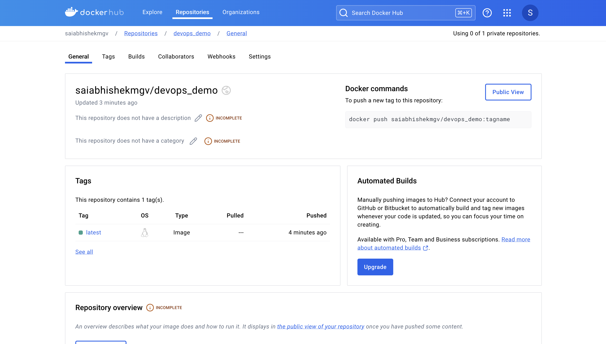

# Homework 8
I have created the repo from scratch as mentioned in the lecture videos.
Created the CI/CD workflow to automatically test, build and push the image to the dockerhub.

## Screenshots:
The docker hub screenshot showing the image publised on dockerhub.
